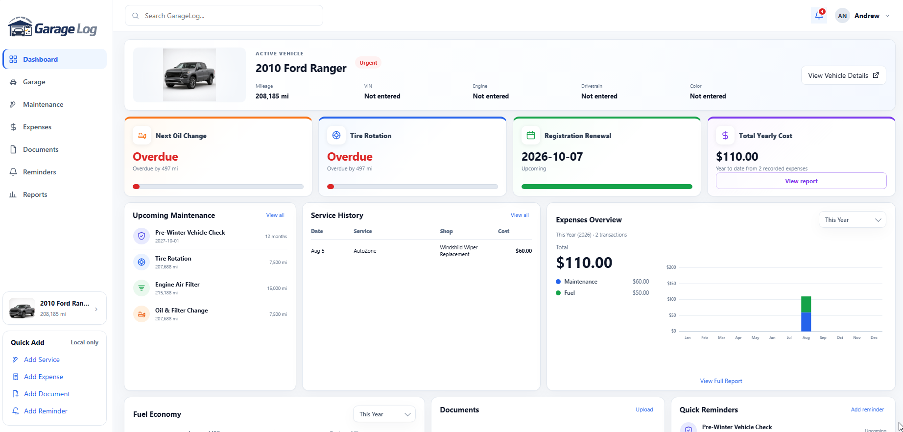
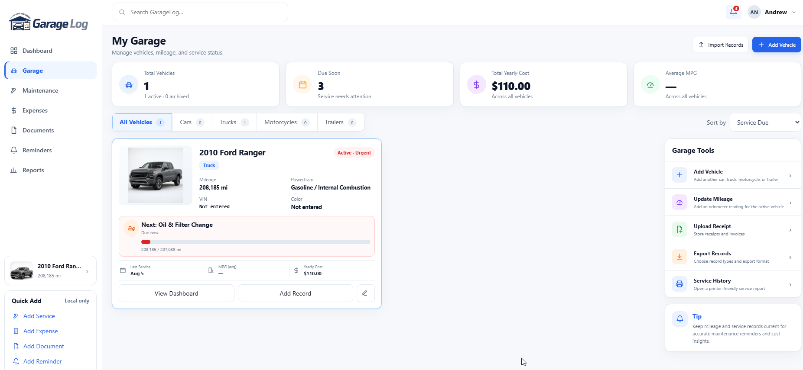
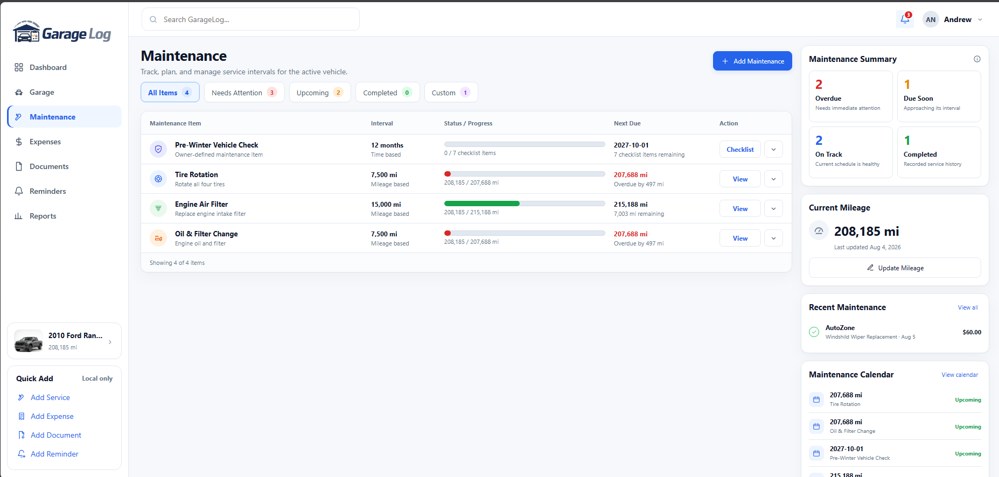
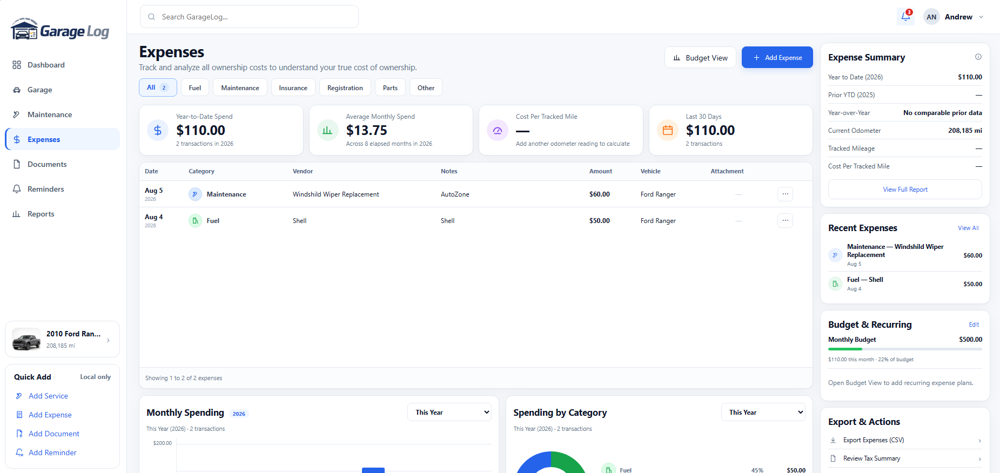
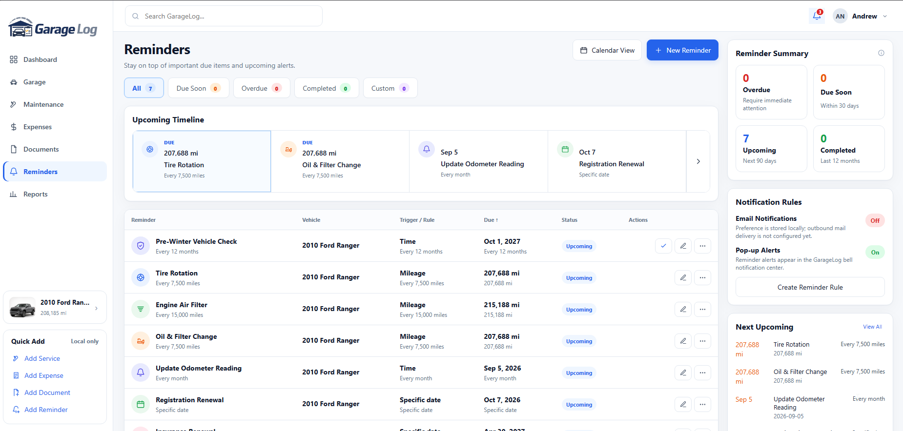
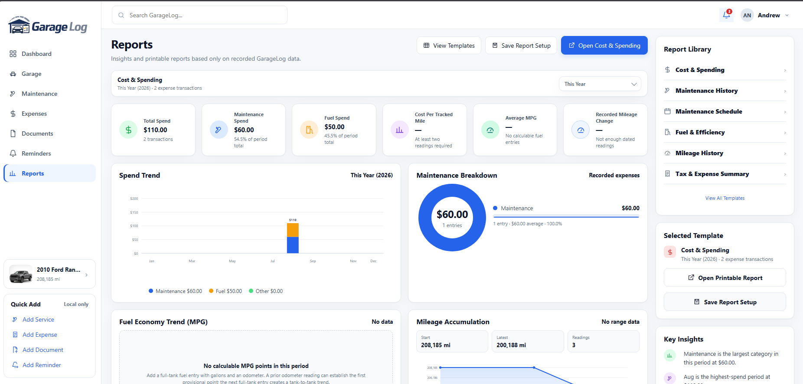

# GarageLog

GarageLog is a local-first, self-hosted vehicle maintenance and document-tracking application. It stores its database, documents, vehicle images, profile images, OCR text, and authentication records on the GarageLog host.

## Interface preview

<p align="center">
  
</p>

<details>
<summary><strong>View more GarageLog screenshots</strong></summary>

<br>

### My Garage



### Maintenance



### Expenses



### Reminders



### Reports



</details>

## Docker quick start

1. Copy `.env.example` to `.env` and set `GARAGELOG_UPDATE_REPOSITORY` after creating the GitHub repository.
2. Keep `GARAGELOG_BIND_ADDRESS=127.0.0.1` for same-machine or reverse-proxy access, or set it to `0.0.0.0` for direct access from the trusted LAN.
3. Run `docker compose up -d --build`.
4. Open `http://localhost:6001` and create the first administrator account.
5. Complete the first-vehicle setup wizard.

Persistent application data is stored in the `garagelog-data` Docker volume. Back up that volume before updating or moving the installation.

After the GitHub workflow publishes a container image, set `GARAGELOG_IMAGE=ghcr.io/owner/repository:latest` and run `docker compose -f compose.ghcr.yaml up -d` to deploy the published image without rebuilding it locally.

## Update notifications

Set `GARAGELOG_UPDATE_REPOSITORY` to `owner/repository`. GarageLog checks GitHub's latest public release endpoint from the server at most once every six hours. The included tag workflow creates a GitHub Release with generated release notes, which provides the destination for the in-app update link. When a newer semantic version is available, administrators receive a bell notification and a dashboard message linking to the GitHub release.

The update check sends no GarageLog records, usernames, documents, vehicle data, or telemetry. It only requests public release metadata from GitHub. Leave the variable empty to disable outbound update checks.

## OCR and document tools

The Docker image includes Tesseract OCR, Poppler, LibreOffice, and qrencode. No separate helper process needs to remain running.

## Reverse proxy and HTTPS

GarageLog is intended for a trusted local network. Do not expose the container directly to the public internet. For remote access, place it behind a maintained HTTPS reverse proxy or private VPN.

Set `GARAGELOG_REQUIRE_HTTPS=true` only when HTTPS is correctly terminated by GarageLog or a trusted reverse proxy. When using a reverse proxy, set `GARAGELOG_TRUSTED_PROXIES` to its IP address. Multiple addresses can be comma-separated.

## Build from source

```bash
dotnet restore src/GarageLog.Web/GarageLog.Web.csproj
dotnet publish src/GarageLog.Web/GarageLog.Web.csproj -c Release -o publish
```

The application targets .NET 8.

## Release safety

The repository intentionally excludes databases, uploads, profile images, vehicle photos, logs, environment files, archives, IDE state, and local data directories. Review `RELEASE-CHECKLIST.md` before publishing a release.
